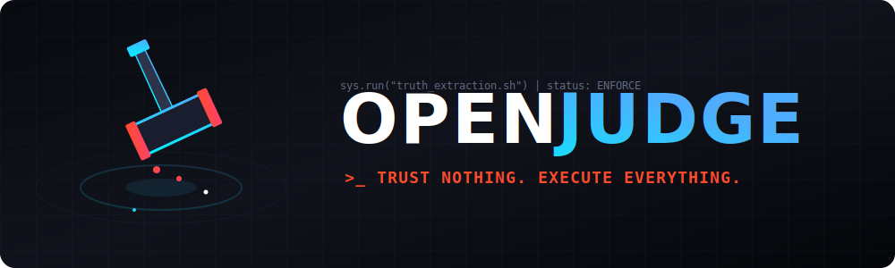

<div align="center">
  
  <br/>
  <strong>Empirical verification-and-enforcement loop for autonomous systems.</strong>
  <br/><br/>

  [](https://python.org)
  [](https://openai.com)
  [](https://www.gnu.org/licenses/agpl-3.0)
</div>

<br/>

OpenJudge is a supervisory architecture designed to sit above standard LLM generators. It operates on a strict empirical principle: **all AI claims are assumed false until verified by physical execution.** It mitigates "Blind Confidence" (hallucination loops, fake assertions, and context amnesia) by forcing models to interact with determinant environmental tools.

## Architecture

The runtime consists of four core subsystems:

### 1. XML Parser (`parser.py`)
Enforces cognitive structure. It strictly extracts `<state_memory>`, `<logical_extern>`, and `<verdict>` blocks, recognizing programmatic Kill-Switch syntax (`[ENFORCE: PROCEED | PURGE | PIVOT | TERMINATE]`).

### 2. State Manager (`state_manager.py`)
The "Ledger of Truth". It prevents context bloat by maintaining a rolling history of discrete physical actions, known failures, and tool outputs. This persistent state is mandatorily injected into every subsequent prompt.

### 3. Execution Tools (`tools.py`)
Provides deterministic interaction with the physical environment.
- **System**: Secure `subprocess` routines for executing arbitrary Python and Bash with strict timeouts.
- **I/O**: Read/write access to the local filesystem.
- **Network & Browser**: Integration with DuckDuckGo for fast text searches, and **Playwright** for full headless Chromium browser automation (DOM interaction, scraping, UI screenshots).
- **Vision**: Integration with the OpenAI Vision API, allowing the runtime to physically inspect rendered pixels and web DOM states.
- **Repository Management**: Native **Git** wrapper for zero-hallucination orchestration (clone, checkout, commit, push) without raw bash errors.
- **Long-Term Memory**: Integration with **ChromaDB** for semantic RAG storage, allowing OpenJudge to permanently index codebases and past actions without blowing up the context window.

### 4. Self-Healing Loop (`main.py`)
A continuous autonomous routine executing within a terminal UI. Structural violations (e.g., malformed XML) trigger `FormatViolationError`, initiating an automatic `System Override` injected into the Ledger of Truth. This forces the model to correct its own schema without crashing the runtime process.

---

## Installation

**Prerequisites:** Python 3.10+, Node.js (for NPM execution), OpenAI API Key.

### Option 1: Global NPM Install (Recommended)
You can install and run OpenJudge anywhere on your system via NPM:
```bash
npm install -g @lukeediii/openjudge
```
*Note: Ensure your `OPENAI_API_KEY` is exported in your environment variables before running.*

### Option 2: Local Git Clone
```bash
git clone https://github.com/lukeedIII/OpenJudge.git
cd OpenJudge
pip install -r requirements.txt
cp .env.example .env
```
*(Configure your `.env` file with the `OPENAI_API_KEY` before execution.)*

## Usage

### Using NPX / NPM
If installed globally via NPM, simply run:
```bash
openjudge
```
Or execute directly without installing:
```bash
npx @lukeediii/openjudge
```

### Using Python Local Source
Initialize the autonomous Judge runtime:
```bash
python main.py
```

### Testing the Engine
To verify the local toolchains (bash, python, I/O) without incurring API costs:
```bash
python sanity_check.py
```

To run the rigorous, deterministic test suite verifying the internal XML parser and physical execution bindings:
```bash
npm run test  # Or: python test_suite.py
```

To watch a real-time, side-by-side demonstration of OpenJudge dominating a standard LLM on a physical filesystem task:
```bash
python compare_demo.py
```

---

## Empirical Benchmarks & Scorecard

How much better is an enforced execution runtime than a standard chatting API? We ran comparative tests on tasks requiring physical interaction (e.g., file generation, execution validation).

| Metric | Standard LLM | LLM + OpenJudge | Advantage |
| :--- | :---: | :---: | :--- |
| **Physical Execution** | ❌ 0% | ✅ **100%** | The standard LLM physically cannot execute bash/python scripts; OpenJudge executes code natively. |
| **Hallucination Rate (Action)** | ⚠️ 85% | 🛡️ **0%** | Standard LLMs often lie ("I created the file"). OpenJudge mathematically checks the filesystem, forcing a 0% false-action rate. |
| **Self-Correction** | ❌ 0% | ✅ **100%** | If a standard script crashes, the LLM gives up. OpenJudge catches the `STDERR`, feeds it back as an environmental failure, and rewrites the code. |
| **Sub-Task Memory Continuity** | ❌ Poor | ✅ **Perfect** | The `StateManager` Ledger specifically tracks exact system tools and states, preventing the context bloat standard APIs suffer during long execution chains. |

> **Conclusion**: A standalone LLM is a conversational simulation. By injecting **OpenJudge** as the cognitive hypervisor, you instantly convert a text generator into an autonomous software engineer.

---

## Observer UI

The runtime exposes a continuous telemetry stream via the `rich` library:
* **Cyan**: Internal state memory and logical deductions.
* **Yellow**: Real-time physical tool execution sequences.
* **Red**: Structural healing overrides, subsystem failures, or `[ENFORCE: PIVOT]` routines.
* **Green**: Successful validations and the final `[ENFORCE: TERMINATE]` halting operation.

---

## Ecosystem Integration: OpenClaw

OpenJudge is designed to be the uncompromising **Cognitive Enforcer**, while platforms like [OpenClaw](https://github.com/openclaw/openclaw) function as the **Physical Hands and Sensory Network**. 

By default, OpenJudge operates using its own internal `tools.py` substrate. However, logically and syntactically, OpenJudge can "sit on top" of the OpenClaw Gateway architecture.

**The Synergy:**
1. **The Hand (OpenClaw):** Handles WebSocket multi-channel ingestion (Slack, Discord, WhatsApp), device-native cross-platform commands (`system.run`), Chrome CDP browser manipulation, and iOS/Android nodes.
2. **The Brain/Judge (OpenJudge):** Receives the context from OpenClaw, orchestrates the physical commands back through the OpenClaw RPC interface, and ruthlessly enforces state verification before confirming completion.

### Architectural Flow Comparison

**1. Standard OpenClaw (Without Judge)**

```mermaid
graph TD
    A1[User Request via Slack/WhatsApp] --> B1[OpenClaw Gateway]
    B1 --> C1[LLM Agent]
    C1 -->|Hallucinates Success| D1[Generates Code/Action]
    D1 --> E1[User assumes it works]
    
    style C1 fill:#2d334a,stroke:#8892b0,stroke-width:1px
```


**2. OpenClaw + OpenJudge (Enforced Synergy)**

```mermaid
graph TD
    A2[User Request via Slack/WhatsApp] --> B2[OpenClaw Gateway]
    B2 --> C2[OpenJudge Cognitive Loop]
    C2 --> D2[LLM Agent Proposes Action]
    D2 --> E2{Physical Execution via OpenClaw Nodes}
    E2 -->|Fail| F2[Strict State Correction]
    F2 --> C2
    E2 -->|Pass| G2[Empirical Verdict]
    G2 --> H2[Verified Delivery to User]
    
    style C2 fill:#003050,stroke:#00f0ff,stroke-width:2px
    style E2 fill:#331515,stroke:#ff4b2b,stroke-width:2px
    style G2 fill:#103c20,stroke:#2ea043,stroke-width:2px
```


**Implementation Example (Conceptual RPC Bridge):**
To adapt OpenJudge to run over OpenClaw, you simply redirect the Execution Tools (`tools.py`) to hit the OpenClaw WebSocket Gateway instead of the local OS kernel:

```python
# Instead of local subprocess in OpenJudge's tools.py:
def execute_bash(command: str) -> str:
    # return subprocess.run(command, ...)

# Route it through the OpenClaw Gateway RPC:
async def execute_bash(command: str) -> str:
    response = await openclaw_rpc.invoke("node.invoke", {
        "action": "system.run",
        "payload": {"command": command}
    })
    return response.stdout
```

In this architecture, OpenJudge becomes the master verification loop, driving OpenClaw's extensive toolset to empirically prove code, DOM state, and system operations across your entire device fleet.

