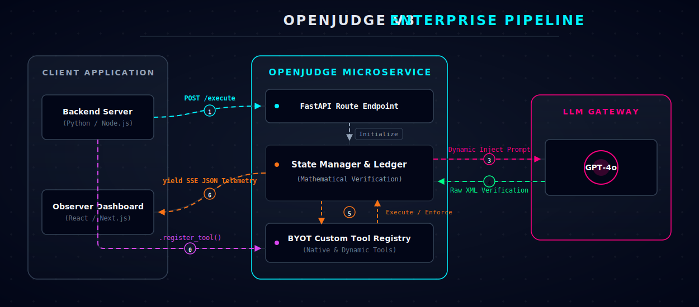

<div align="center">
  
  <br/>
  <strong>Empirical verification-and-enforcement loop for autonomous systems.</strong>
  <br/><br/>

  [](https://python.org)
  [](https://openai.com)
  [](https://www.gnu.org/licenses/agpl-3.0)
</div>

<br/>

OpenJudge is a supervisory architecture designed to sit above standard LLM generators. It operates on a strict empirical principle: **all AI claims are assumed false until verified by physical execution.** It mitigates "Blind Confidence" (hallucination loops, fake assertions, and context amnesia) by forcing models to interact with determinant environmental tools.

## Architecture

The runtime consists of four core subsystems:

### 1. XML Parser (`parser.py`)
Enforces cognitive structure. It strictly extracts `<state_memory>`, `<logical_extern>`, and `<verdict>` blocks, recognizing programmatic Kill-Switch syntax (`[ENFORCE: PROCEED | PURGE | PIVOT | TERMINATE]`).

### 2. State Manager (`state_manager.py`)
The "Ledger of Truth". It prevents context bloat by maintaining a rolling history of discrete physical actions, known failures, and tool outputs. This persistent state is mandatorily injected into every subsequent prompt.

### 3. Execution Tools (`tools.py`)
Provides deterministic interaction with the physical environment.
- **System**: Secure `subprocess` routines for executing arbitrary Python and Bash with strict timeouts.
- **I/O**: Read/write access to the local filesystem.
- **Network & Browser**: Integration with DuckDuckGo for fast text searches, and **Playwright** for full headless Chromium browser automation (DOM interaction, scraping, UI screenshots).
- **Vision**: Integration with the OpenAI Vision API, allowing the runtime to physically inspect rendered pixels and web DOM states.
- **Repository Management**: Native **Git** wrapper for zero-hallucination orchestration (clone, checkout, commit, push) without raw bash errors.
- **Long-Term Memory**: Integration with **ChromaDB** for semantic RAG storage, allowing OpenJudge to permanently index codebases and past actions without blowing up the context window.

### 4. Self-Healing Loop (`main.py`)
A continuous autonomous routine executing within a terminal UI. Structural violations (e.g., malformed XML) trigger `FormatViolationError`, initiating an automatic `System Override` injected into the Ledger of Truth. This forces the model to correct its own schema without crashing the runtime process.

---

## Installation

**Prerequisites:** Python 3.10+, Node.js (for NPM execution), OpenAI API Key.

### Option 1: Global NPM Install (Recommended)
You can install and run OpenJudge anywhere on your system via NPM:
```bash
npm install -g @lukeediii/openjudge
```
*Note: Ensure your `OPENAI_API_KEY` is exported in your environment variables before running.*

### Option 2: Local Git Clone
```bash
git clone https://github.com/lukeedIII/OpenJudge.git
cd OpenJudge
pip install -r requirements.txt
cp .env.example .env
```
*(Configure your `.env` file with the `OPENAI_API_KEY` before execution.)*

## Usage

### Using NPX / NPM
If installed globally via NPM, simply run:
```bash
openjudge
```
Or execute directly without installing:
```bash
npx @lukeediii/openjudge
```

### Using Python Local Source
Initialize the autonomous Judge runtime:
```bash
python main.py
```

### Testing the Engine
To verify the local toolchains (bash, python, I/O) without incurring API costs:
```bash
python sanity_check.py
```

To run the rigorous, deterministic test suite verifying the internal XML parser and physical execution bindings:
```bash
npm run test  # Or: python test_suite.py
```

To watch a real-time, side-by-side demonstration of OpenJudge dominating a standard LLM on a physical filesystem task:
```bash
python compare_demo.py
```

---

## V3 Enterprise Architecture

OpenJudge is no longer just a CLI tool. It is a fully object-oriented SDK and web-streaming engine designed for enterprise integration.

<div align="center">
  
</div>

### 1. The BYOT SDK (Bring Your Own Tools)
You can instantiate `OpenJudgeEngine` directly in your Python backends. The prompt architecture dynamically injects your custom tools (`engine.register_tool`) directly into the LLM's XML registry.

```python
from engine import OpenJudgeEngine

engine = OpenJudgeEngine(max_iterations=10)

# Inject your company's proprietary tool into the cognitive loop
engine.register_tool(
    name="query_secure_database", 
    description="Payload: sql_query. Use: Reads secure internal employee records.",
    func=my_custom_db_function
)
```

### 2. Event-Driven Telemetry (Observer UI Ready)
OpenJudge does not use static `return` statements or blocking console prints. It exposes an `AsyncGenerator` that streams `yield` packets of structured JSON. This allows React/Vue developers to hook into the stream and render real-time, ChatGPT-style interactive visualization dashboards.

```python
# The engine organically yields JSON events (THOUGHT_PROCESS, TOOL_RESULT)
async for event_json in engine.stream_execute("Query HR for ID 4242"):
    print(event_json) 
```

### 3. The FastAPI Microservice
OpenJudge officially ships with a high-performance **FastAPI** wrapper (`api.py`), allowing any system on your network to command the engine over HTTP and consume the JSON telemetry via **Server-Sent Events (SSE)**.

```bash
# Boot the Microservice
uvicorn api:app --host 0.0.0.0 --port 8000
```

---

## 🚀 Premium Enterprise Use Cases

OpenJudge converts conversational AI into a mathematically bound execution engine. We have documented 6 high-fidelity architecture patterns demonstrating the immediate business value of the OpenJudge V3 SDK:

| Use Case | Description | Primary Tools Used |
| :--- | :--- | :--- |
| **[01. Autonomous QA Testing](docs/use-cases/01-autonomous-qa.md)** | Replace fragile Cypress/Selenium scripts with reliable, self-healing Visual QA bots. | `browser_action`, `Vision API` |
| **[02. Data Extraction](docs/use-cases/02-data-extraction.md)** | Extract financial or legal data from live sites/PDFs with zero hallucination. | `browser_action`, `read_file` |
| **[03. Self-Healing DevOps](docs/use-cases/03-devops-infrastructure.md)** | Autonomously diagnose server logs and deploy bash remediations at 3 AM. | `execute_bash`, `read_file` |
| **[04. Deterministic Code Gen](docs/use-cases/04-code-generation.md)** | Write Python scripts, run them, and recursively fix bugs before delivery. | `execute_python`, `write_file` |
| **[05. Secure Orchestration](docs/use-cases/05-secure-orchestration.md)** | Use the BYOT SDK to safely route internal APIs without exposing credentials. | `engine.register_tool()` |
| **[06. Long-Term Memory](docs/use-cases/06-long-term-memory.md)** | Persist state across infinite codebase tokens without hitting API limits. | `memory_query`, ChromaDB |

---

## 360° Empirical Benchmark Suite

To definitively prove the superiority of an enforced execution cycle over standard conversational APIs, we maintain a strict suite of complex tasks designed to break standard LLMs.

| Capability | Benchmark Task | Standard LLM | OpenJudge Engine |
| :--- | :--- | :---: | :--- |
| **Logic & Execution** | Solve a complex multi-remainder math riddle. | ❌ Hallucinates an answer | ✅ Spawns `python`, writes brute-force script, structurally validates result. |
| **Live DOM Vision** | Extract the exact `#1` live headline from Hacker News. | ❌ Fails (Training data cutoff constraint) | ✅ Spawns headless Chromium, evaluates CSS selectors, extracts live text. |
| **Long-Term Amnesia** | Recall a previously injected "Project Eclipse" secret. | ❌ Fails (Context window wiped) | ✅ Pushes data/embeddings to ChromaDB, executes semantic `memory_query`. |

> **Conclusion**: A standalone LLM is a conversational simulation. By injecting **OpenJudge** as the cognitive hypervisor, you instantly convert a text generator into a highly-capable, full-stack autonomous software engineer.

---

## Observer UI

The runtime exposes a continuous telemetry stream via the `rich` library:
* **Cyan**: Internal state memory and logical deductions.
* **Yellow**: Real-time physical tool execution sequences.
* **Red**: Structural healing overrides, subsystem failures, or `[ENFORCE: PIVOT]` routines.
* **Green**: Successful validations and the final `[ENFORCE: TERMINATE]` halting operation.

---

## Ecosystem Integration: OpenClaw

OpenJudge is designed to be the uncompromising **Cognitive Enforcer**, while platforms like [OpenClaw](https://github.com/openclaw/openclaw) function as the **Physical Hands and Sensory Network**. 

By default, OpenJudge operates using its own internal `tools.py` substrate. However, logically and syntactically, OpenJudge can "sit on top" of the OpenClaw Gateway architecture.

**The Synergy:**
1. **The Hand (OpenClaw):** Handles WebSocket multi-channel ingestion (Slack, Discord, WhatsApp), device-native cross-platform commands (`system.run`), Chrome CDP browser manipulation, and iOS/Android nodes.
2. **The Brain/Judge (OpenJudge):** Receives the context from OpenClaw, orchestrates the physical commands back through the OpenClaw RPC interface, and ruthlessly enforces state verification before confirming completion.

### Architectural Flow Comparison

**1. Standard OpenClaw (Without Judge)**

```mermaid
graph TD
    A1[User Request via Slack/WhatsApp] --> B1[OpenClaw Gateway]
    B1 --> C1[LLM Agent]
    C1 -->|Hallucinates Success| D1[Generates Code/Action]
    D1 --> E1[User assumes it works]
    
    style C1 fill:#2d334a,stroke:#8892b0,stroke-width:1px
```


**2. OpenClaw + OpenJudge (Enforced Synergy)**

```mermaid
graph TD
    A2[User Request via Slack/WhatsApp] --> B2[OpenClaw Gateway]
    B2 --> C2[OpenJudge Cognitive Loop]
    C2 --> D2[LLM Agent Proposes Action]
    D2 --> E2{Physical Execution via OpenClaw Nodes}
    E2 -->|Fail| F2[Strict State Correction]
    F2 --> C2
    E2 -->|Pass| G2[Empirical Verdict]
    G2 --> H2[Verified Delivery to User]
    
    style C2 fill:#003050,stroke:#00f0ff,stroke-width:2px
    style E2 fill:#331515,stroke:#ff4b2b,stroke-width:2px
    style G2 fill:#103c20,stroke:#2ea043,stroke-width:2px
```


**Implementation Example (Conceptual RPC Bridge):**
To adapt OpenJudge to run over OpenClaw, you simply redirect the Execution Tools (`tools.py`) to hit the OpenClaw WebSocket Gateway instead of the local OS kernel:

```python
# Instead of local subprocess in OpenJudge's tools.py:
def execute_bash(command: str) -> str:
    # return subprocess.run(command, ...)

# Route it through the OpenClaw Gateway RPC:
async def execute_bash(command: str) -> str:
    response = await openclaw_rpc.invoke("node.invoke", {
        "action": "system.run",
        "payload": {"command": command}
    })
    return response.stdout
```

In this architecture, OpenJudge becomes the master verification loop, driving OpenClaw's extensive toolset to empirically prove code, DOM state, and system operations across your entire device fleet.

